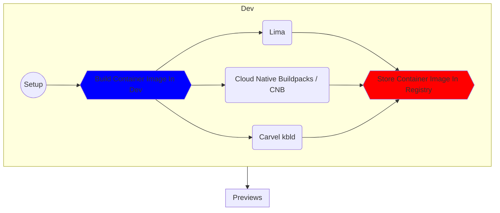

#I'm

```mermaid
flowchart TD;

    setup-dev((Setup))

    subgraph Dev

        bci{{Build Container Image In Dev}}
        click bci "vfarcic/cncf-demo/blob/main/manuscript/build-container-image/story.md" _blank
        style bci fill:blue

        bci-lima(Lima)
        bci-buildpacks(Cloud Native Buildpacks / CNB)
        bci-knld(Carvel kbld)

        setup-dev-->bci
        bci-->bci-lima-->registry
        bci-->bci-buildpacks-->registry
        bci-->bci-knld-->registry

        registry{{Store Container Image In Registry}}
        style registry fill:red
    end

    Dev --> Previews

    subgraph Previews
    end
```