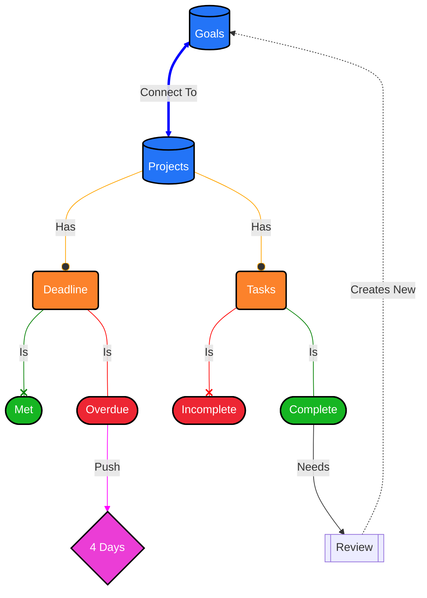

```mermaid
flowchart TD
    G[("Goals")] <== Connect To ===> P[("Projects")]
    P -- Has ---o PD("Deadline") & PT("Tasks")
    PD -- Is ---x MT(["Met"])
    PD -- Is ---- OV(["Overdue"])
    OV -- Push ---> OVF{"4 Days"}
    PT -- Is ---x IC(["Incomplete"])
    PT -- Is ---- C(["Complete"])
    C -- Needs ---> R[["Review"]]
    R -. Creates New ..-> G
     G:::blue
     P:::blue
     PD:::orange
     PT:::orange
     MT:::green
     OV:::red
     OVF:::pink
     IC:::red
     C:::green
    classDef blue fill:#2374f7,stroke:#000,stroke-width:2px,color:#fff
    classDef pink fill:#eb3dd6,stroke:#000,stroke-width:2px,color:#fff
    classDef orange fill:#fc822b,stroke:#000,stroke-width:2px,color:#fff
    classDef red fill:#ed2633,stroke:#000,stroke-width:2px,color:#fff
    classDef green fill:#16b522,stroke:#000,stroke-width:2px,color:#fff
    linkStyle 0 stroke:blue,fill:none
    linkStyle 1 stroke:orange,fill:none
    linkStyle 2 stroke:orange,fill:none
    linkStyle 3 stroke:green,fill:none
    linkStyle 4 stroke:red,fill:none
    linkStyle 5 stroke:magenta,fill:none
    linkStyle 6 stroke:red,fill:none
    linkStyle 7 stroke:green,fill:none

click G "https://github.com/TuPhung1787/FullStack" "Study Full Stack"
click P "https://github.com/TuPhung1787/TuPhung" "My Project"
```